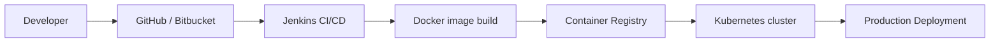

<!-- markdownlint-disable MD033 MD034 -->
<h1 align="center">Hi 👋, I'm Yousef Emad Mikhail</h1>
<h3 align="center">Backend-focused Node.js developer (NestJS / Express) & web penetration tester</h3>


<p align="left">
  
</p>

- 🌱 I’m currently deepening my knowledge in **React, Node.js, modern backend architectures & OWASP Top 10 web vulnerabilities**
- 💼 I work with the **MERN stack** to build scalable, production‑ready web applications
- 🛡️ I’m passionate about **web application security, bug hunting & secure coding best practices**
- 👨‍💻 All of my projects are available at **[github.com/yous0001](https://github.com/yous0001)**
- 📝 Check out my portfolio: **[yousefemad.vercel.app](https://yousefemad.vercel.app)**
- 📫 Reach me at **mad33833@gmail.com**

<h3 align="left">Connect with me</h3>
<p align="left">
  <a href="https://linkedin.com/in/yousefemad-" target="_blank" rel="noreferrer">
    
  </a>
</p>

---

<h3 align="left">Tech stack & skills</h3>

- <b>Primary backend</b>: Node.js, NestJS, Express.js, Socket.IO, Bun, REST APIs, GraphQL
- <b>Databases</b>: MongoDB (main), PostgreSQL, MySQL
- <b>Frontend</b>: React, Next.js (for full‑stack and dashboard UIs), JavaScript (ES6+), TypeScript, HTML5, CSS3, Bootstrap, Tailwind CSS, Sass
- <b>DevOps & Tools</b>: Docker, Kubernetes, Jenkins, Bitbucket, Git, GitHub, Postman, Linux
- <b>Testing</b>: Jest
- <b>Programming languages</b>: JavaScript, TypeScript, Python, C++
- <b>Security & pentesting</b>: Web application penetration testing, OWASP Top 10, API security, input validation & hardening, basic network and infrastructure security concepts

<h3 align="left">Languages and Tools</h3>

<h4 align="left">Backend stack</h4>
<p align="left">
  <a href="https://nodejs.org" target="_blank" rel="noreferrer">
    
  </a>
  <a href="https://nestjs.com/" target="_blank" rel="noreferrer">
    
  </a>
  <a href="https://expressjs.com" target="_blank" rel="noreferrer">
    
  </a>
  <a href="https://socket.io/" target="_blank" rel="noreferrer">
    
  </a>
  <a href="https://bun.sh/" target="_blank" rel="noreferrer">
    
  </a>
  <a href="https://graphql.org" target="_blank" rel="noreferrer">
    
  </a>
  <a href="https://postman.com" target="_blank" rel="noreferrer">
    
  </a>
</p>

<h4 align="left">Testing</h4>
<p align="left">
  <a href="https://jestjs.io/" target="_blank" rel="noreferrer">
    
  </a>
</p>

<h4 align="left">Databases</h4>
<p align="left">
  <a href="https://www.mongodb.com/" target="_blank" rel="noreferrer">
    
  </a>
  <a href="https://www.postgresql.org/" target="_blank" rel="noreferrer">
    
  </a>
  <a href="https://www.mysql.com/" target="_blank" rel="noreferrer">
    
  </a>
</p>

<h4 align="left">DevOps / CI-CD</h4>
<p align="left">
  <a href="https://www.docker.com/" target="_blank" rel="noreferrer">
    
  </a>
  <a href="https://kubernetes.io/" target="_blank" rel="noreferrer">
    
  </a>
  <a href="https://www.jenkins.io/" target="_blank" rel="noreferrer">
    
  </a>
  <a href="https://bitbucket.org/" target="_blank" rel="noreferrer">
    
  </a>
  <a href="https://git-scm.com/" target="_blank" rel="noreferrer">
    
  </a>
  <a href="https://www.linux.org/" target="_blank" rel="noreferrer">
    
  </a>
</p>

<h4 align="left">Frontend (sometimes)</h4>
<p align="left">
  <a href="https://nextjs.org/" target="_blank" rel="noreferrer">
    
  </a>
  <a href="https://reactjs.org/" target="_blank" rel="noreferrer">
    
  </a>
  <a href="https://getbootstrap.com" target="_blank" rel="noreferrer">
    
  </a>
  <a href="https://tailwindcss.com/" target="_blank" rel="noreferrer">
    
  </a>
  <a href="https://sass-lang.com" target="_blank" rel="noreferrer">
    
  </a>
  <a href="https://www.w3.org/html/" target="_blank" rel="noreferrer">
    
  </a>
  <a href="https://www.w3schools.com/css/" target="_blank" rel="noreferrer">
    
  </a>
</p>

<h4 align="left">Programming languages</h4>
<p align="left">
  <a href="https://developer.mozilla.org/en-US/docs/Web/JavaScript" target="_blank" rel="noreferrer">
    
  </a>
  <a href="https://www.typescriptlang.org/" target="_blank" rel="noreferrer">
    
  </a>
  <a href="https://www.python.org" target="_blank" rel="noreferrer">
    
  </a>
  <a href="https://www.w3schools.com/cpp/" target="_blank" rel="noreferrer">
    
  </a>
</p>

---

<h3 align="center">Architecture & workflow diagrams</h3>

<details>
  <summary><b>MERN + backend architecture</b></summary>

```mermaid
flowchart LR
  User[User Browser] --> Frontend[Next.js / React]
  Frontend --> API[NestJS / Express (Node.js)]
  API --> MongoDB[(MongoDB)]
  API --> PostgreSQL[(PostgreSQL)]
  API --> MySQL[(MySQL)]
```

</details>

<details>
  <summary><b>CI/CD & DevOps pipeline</b></summary>



</details>

---

<h3 align="left">GitHub stats</h3>

<p>
  
</p>

<p>
  &nbsp;
  
</p>
